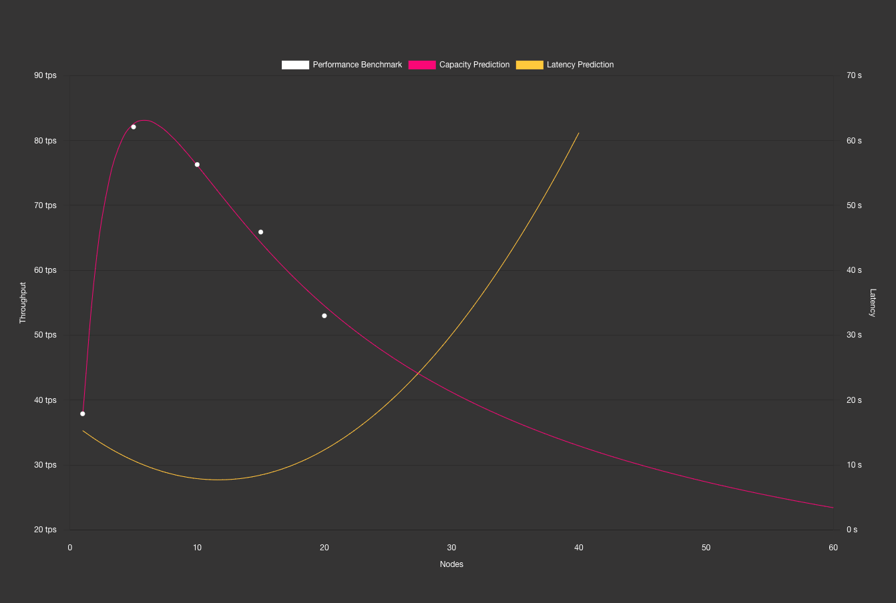
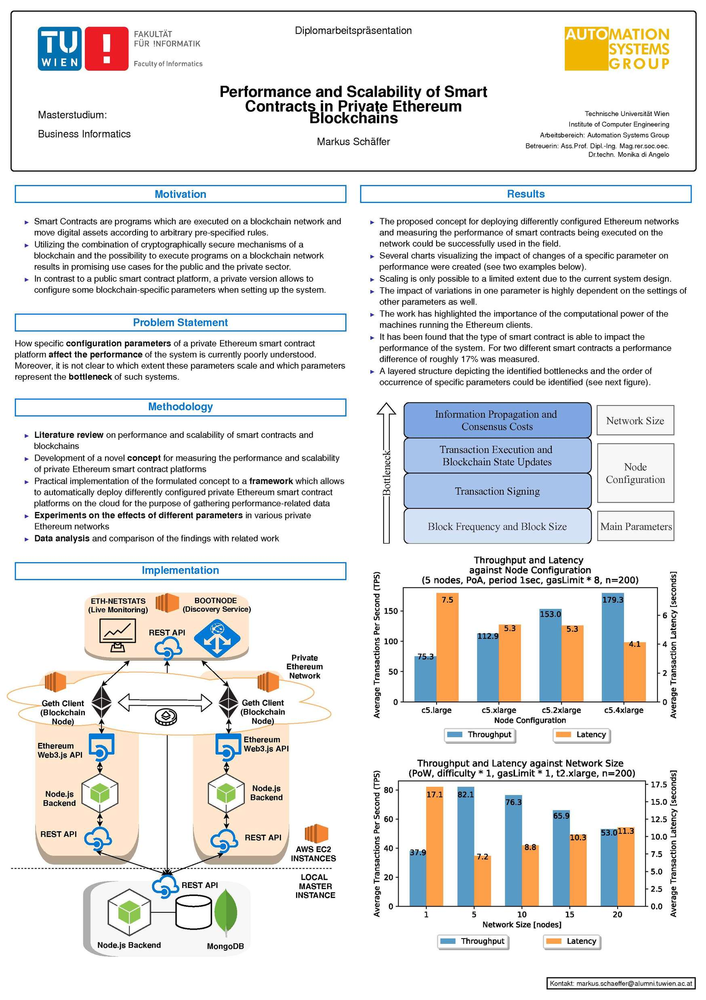

# But will it scale ?

`"Will it scale ?"` is an open source Predictive Analysis Platform that enables you to engineer **scalable** distributed applications, networks and other systems, **by applying mathematical models to bytesized performance measurements**. This initiative is the product of 3 years of R&D at [Stacktical (DSLA Protocol)](https://stacktical.com), and our hands-on experience with capacity planning in cloud computing environments. We are proud to make it public, for everyone to enjoy, direct our efforts towards the blockchain industry.

## Objective

The initial objective of this project is to surface mathematical relations between the performance metrics of blockchain networks, with a focus on Polkadot, the driving force of interoperability in the blockchain industry (ergo the foundation of increasingly complex, end-to-end, cross-chain testing scenarios).

When the value of two system metrics seem to vary in relation to each other, it becomes possible to use them as mathematical coordinates, and fit these coordinates into predictive mathematical models. 

In other words, using mathematical models that can predict the next values in a series, **gives us the ability to predict the next values in a series of blockchain performance metrics**, provided they are bound by maths.  

This scientific approach to capacity planning alleviates testing requirements (less tests, less time), a significant part of the guesswork involved in scalability-driven architectural, coding and configuration choices, and the overall quality of builds before they're deployed to production.

Our initial research at [Stacktical](https://stacktical.com/) show that such relation seem to exist between the number of validating nodes in a blockchain network, and the throughput of the system, expressed in transactions per seconds (TPS).

Instead of provisionning complex, costly testnets with hundreds of validating nodes, and running hundreds of throughput measurements, `"Will it scale ?"` enables you to chart, mathematically quantify and govern the scalability of your system **with only 10 performance measuremenents or so**.

This also means that the `"Will it scale ?"` platform can serve as a tool to scientifically debunk false bockchain TPS claims. Is this is your goal, we'd be happy to hear from you at [contact@stacktical.com](mailto:contact@stacktical.com).


## General Requirements

`"Will it scale ?"`  is meant to work on Linux and Mac OS machines with:   

* a [Node.js 10.0+](https://nodejs.org/) runtime environment to execute applications and manage dependencies
* a [Docker 2.0+](https://docs.docker.com/) installation to build and manage application containers

## Platform Architecture

The projects is comprised of three main components.

### `willitscale-r-server`

A HTTP R server to make online predictive analysis using mathematical models.

### `willitscale-api`

A Node.js GraphQL API server to query the `willitscale-r-server` and implements the business logic of predictions.

### `willitscale-client`

A Vue.js GraphQL API client, to submit performance test results to the `willitiscale-api` from your browser.

You will need to build and run these components to run your end-to-end predictions scenarios.

# Local Deployment

## Automated Deployment (TL;DR)

Install the following tools :

- [kubectl](https://kubernetes.io/docs/tasks/tools/install-kubectl/)
- [kind](https://kind.sigs.k8s.io/docs/user/quick-start/)
- [skaffold](https://skaffold.dev/docs/install/)

Built the images and run against a local **kind** cluster using the following command :

```bash
kind create cluster --name willitscale-polkadot
skaffold run --port-forward
```

## Manual Deployment

### Reachability

Ensure that docker containers can communicate with each other by setting up the docker bridge network: 

`docker network create --driver bridge willitscale-polkadot`

### willitscale-r-server

#### Building your R Server

The `willitscale-r-server` is designed to run inside a Docker container.  
To build your container, use the following command in the root folder of your component.

`docker build -t willitscale-r-server .`

#### Running your R Server

By default, the R server runs on the 6311 port, inside your Docker container.
To run your container by mapping the 6311 port in Docker to the 10001 port in your machine, use the following command:

`docker run -d -p 10001:6311 -t -P --network=willitscale-polkadot --name willitscale-r-server willitscale-r-server`

Your server should be now running on the **10001 port.**

### willitscale-api

#### Install dependencies

We are using npm to manage dependencies for the `willitscale-api` API server.

**If you plan on using the server locally,** simply use `npm install` from the `willitscale-api` folder.  
**If you plan to host it instead**, the Dockerfile will take care of installing dependencies for you, while building the container.

#### Building your GraphQL API Server

You can either build the server locally using npm, or build your server as a Docker container for further deployment (e.g. in Kubernetes).

##### Locally

Set the environment variable and build the server using the following command:  
`NODE_ENV="development" npm run build`

##### In Docker

Build the server using the following Docker command:  
`docker build -t willitscale-api . --build-arg NODE_ENV=development`

#### Running your GraphQL API Server

##### Locally

Set the environment variable and run the server using the following command:  
`NODE_ENV="development" npm run start`

##### In Docker

Run the server using the following Docker command:
`docker run -p 10000:10000 -v $(pwd)/dist/:/var/www/willitscale-api/public/dist/ --network=willitscale-polkadot -e SERVICE_R_HOST=willitscale-r-server -e SERVICE_R_PORT=6311 --name willitscale-api willitscale-api`


Your server should be now running on the **10000 port.**

### willitscale-client (optional)

`willitscale-client` provides a simple way to visualize and plot the predictions returned by the `willitscale-api`, in your browser.

#### Install dependencies

We are using npm to manage dependencies for the `willitscale-client` API client.  
Simply use `npm install` from the `willitscale-client` folder to install them.

#### Serve the client locally

Make sure `willitscale-r-server` and `willitscale-api` are running, then set the environment variable and run `willitscale-client` using the following command:  

`NODE_ENV="development" npm run serve`

Your client should be now running at **[http://localhost:8080](http://localhost:8080)**.



## Verify installation

Now that both our HTTP R server and GraphQL API are running, it is time to try running a prediction.

GraphQL Playground is a graphical, interactive, in-browser GraphQL IDE, created by Prisma and based on GraphiQL (ndlr: the default playground for GraphQL). You can find more information about GraphQL Playgroun in the [Apollo documentation](https://www.apollographql.com/docs/apollo-server/testing/graphql-playground/).

To get started, go to `http://localhost:10000`, or the address matching your deployment.

Then use the following example to give the playground a try:

```
mutation {
  predictCapacity(points:
    [
      {
        p: 1,
        Rt: 17.1,
        Xp: 37.9
      },
      {
        p: 5,
        Rt: 7.2,
        Xp: 82.1
      },
      {
        p: 10,
        Rt: 8.8,
        Xp: 76.3
      },
      {
        p: 15,
        Rt: 10.3,
        Xp: 65.9
      },
      {
        p: 20,
        Rt: 11.3,
        Xp: 53
      }
    ]
  )
}
```
  
Where:  

* p represents **concurrency** (e.g. validating nodes in the network)
* Rt represents **latency** (e.g. transaction latency in seconds)
* Xp represents **throughput** (e.g. transactions per second)

The result pane should now be displaying a stringified JSON object comprised of `nodes vs throughput` points coordinates and other information, predicted from the specified payload. 

Here is what the console looks like when you run a prediction: 


# Remote Deployment

## Requirements

A functional Kubernetes cluster (GKE, EKS, minikube, etc) accessible through kubectl, to orchestrate the platform containers.

## Create a new deployment

To create a new deployment run the following command from the root folder of this repository:  

`kubectl create -f k8s/kubernetes.deployment.yaml`

This will automatically pull the  `willitscale-r-server` and `willitscale-api` from the Docker registry.

## Access the remote cluster locally

If you still want the GraphQL Playground to be reachable locally at `http://localhost:10000`, use:

` kubectl port-forward svc/willitscale-api 10000:10000`

The Playground is now reachable at [http://localhost:10000/](http://localhost:10000/), and forwarding your request to the remote `willitscale-api`.

# API documentation

Your server documentation is available in the GraphQL Playground. Two predictive queries are available at this stage:

- A **`predictCapacity`** GraphQL mutation returning:

  - The network’s `nodes vs throughput` (scalability) chart points
  - The network’s `peak capacity` point
  - Quantified scalability bottlenecks (contention / coherency)

- A **`predictLatency`** GraphQL mutation returning:
  - The network’s `nodes vs latency` chart points

We originally planned on returning the network’s `latency at peak capacity` point, from the `predictLatency` mutation.

Instead, we built `willitscale-client` so that this point is directly visible on a chart, and we started implementing a metric-agnostic `makePrediction` mutation in `willitscale-api` that will ultimately serve the same purpose in a wider variety of scenarios (e.g. predicting the network's throughput (Xp) for a given concurrency (p)).

# About Predictions

## Measurements used in predictions

To answer the `"Will it scale ?"` question, the Platform needs to be fed with performance measurements formatted as a JSON.   

All available predictions are currently using the demo dataset in Vienna's Technical University student, M. Schäffer's whitepaper, about the "Performance and Scalability of Private Ethereum Blockchains". Markus and his team ran thousands of measurements to surface the the insights below.



As this platform evolves with the feedback of the community, more performance measurements from different applications, networks and systems will be added to the list of available demonstration datasets (e.g. Substrate / Polkadot performance measurements).

## Dealing with prediction failures

Nobel Prize recipient and quantum physicist Niels Bohr used to say that **"Prediction is very difficult, especially when it's about the future."**

In the realm of Data Science, it's important to embrace that predictions can fail. In our experience, there are two main reasons for that :

**1. Bad performance measurements**

Predictions can fail if they detect uncommon patterns in the performance measurements they process. It is important to always chart your measurements once, and remove noisy coordinates from your mesurements, before submitting them to the predictive engine.

Sometimes, what appears to be a clean set of measurements is in fact a perfectly wrong series of measurements.
Rethinking your entire performance testing protocol might help in such case.

**2. Wrong mathematical models**

Predictions can fail if we try to fit performance measurements to the wrong mathematical models, or if we use the wrong mathematical functions to this model in the code (e.g. `nls` versus `nlxb` nonlinear regression functions in R).

In the future, it would make sense to increase the number of mathematical models available in this repository.

## Contention & Coherency

All systems experience contention and coherency penalties, undermining their ability to scale. The mathematical models we are using lets you quantify these penalties, to surface general areas of improvement of the system's capacity, latency and overall scalability.

Contention is a state of conflict over access to a shared resource (e.g conflicting DApp transactions accessing the same data region). It forces transactions to be dealt with in a serialized way.   

Coherency is a state where the data in a cache is up to date with the system's memory. Ensuring it requires extra, costly synchronisation efforts from your system.

We would suggest adding scalability bottlenecks checks to a CI/CD pipeline, to validate the scalability of builds before they're deployed to production.

## TODO

Below are some of the things we thought of adding to the scope of the platform, as we were developing this first version. Provided they match what the community would like to do moving forward, they will be properly turn into issues in due time.

### Benchmarking

- Properly thank Markus and his team for his great work with the thesis
- Add more sample Substrate / Polkadot and other blockchain benchmark datasets

### Predictive analysis

- Describe the mathematical models currently used in the platform
- Finish implementing the `makePrediction` mutation

### Visualization

- Enable user benchmark payload input on `willitscale-client`
- Compare the scalability of different blockchain on `willitscale-client`

### Typings

- Use `npm run codegen` to generate TypeScript code from the `willitscale-api` GraphQL schema
- Implement type checks in the `willitscale-client` and `willitscale-api`

### Containerization

- Add Dockerfile to `willitscale-client`

### Deployment

- Add deployment information to the README


## About Stacktical (DSLA Protocol)

<p align="center">
  
</p>

Stacktical is a french fintech company specialized in IT Service Management (ITSM) and IT Service Governance. 

Their flagship product, [DSLA Protocol](https://stacktical.com), is an autonomous blockchain protocol to document, bargain and enforce service commitments between third party service providers and their customers, using peer-to-peer, electronic Service Level Agreement (SLA) contracts.

As outsourcing application and network services increasingly expose individuals and corporations to service disruptions, DSLA Protocol enables outsourced third party service providers to offer verifiable, more transparent service level guarantees to their customers, to continuously adapt to changing service level needs, and to gracefully mitigate the economic impact of bad service levels using the DSLA cryptocurrency token. 

For more information about Stacktical and DSLA, please go to [stacktical.com](https://stacktical.com)


